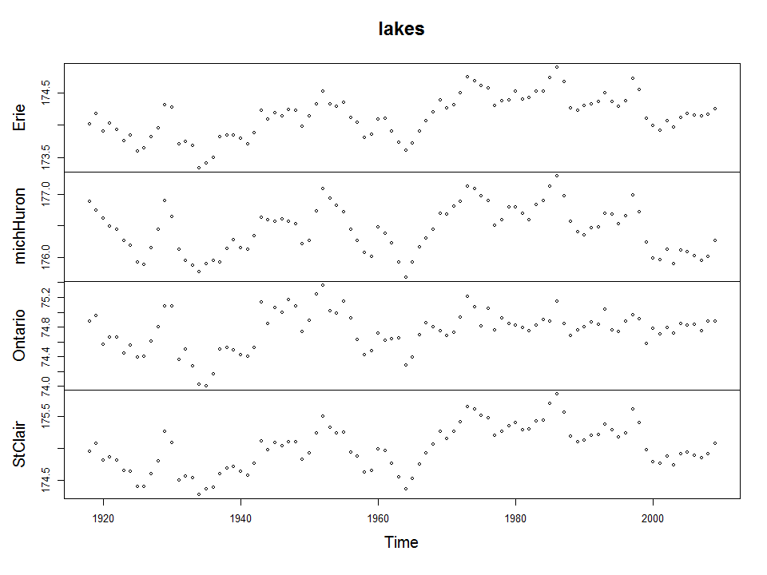
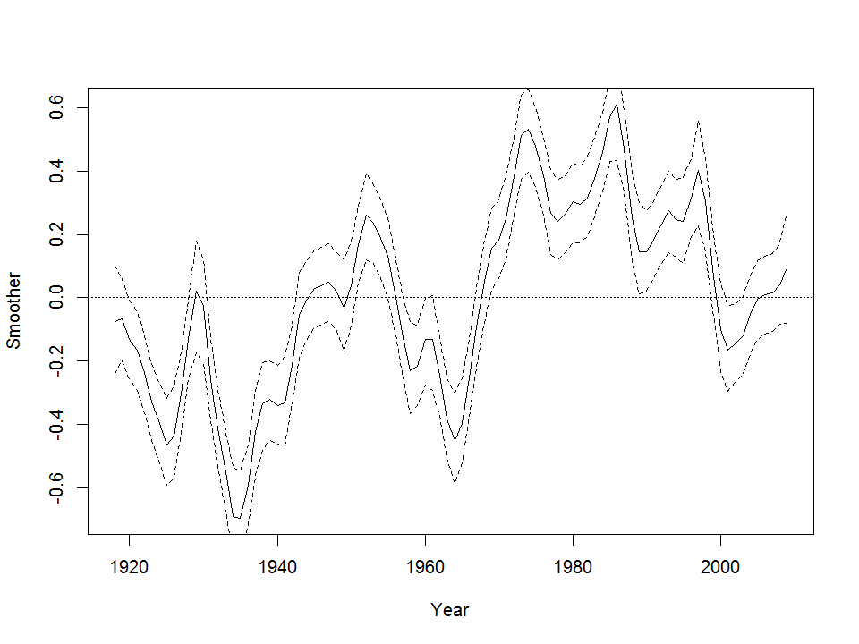
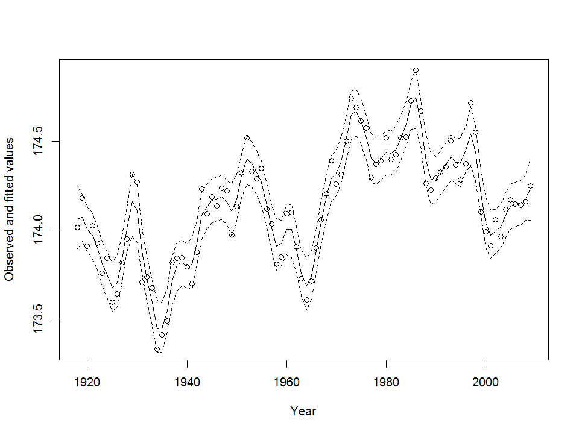
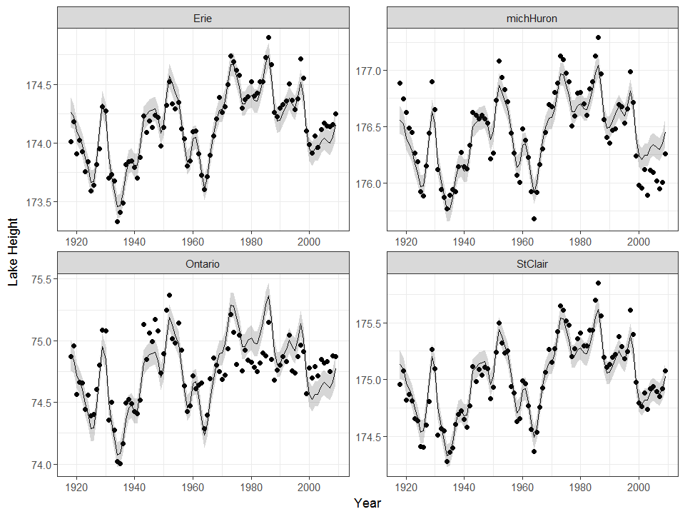
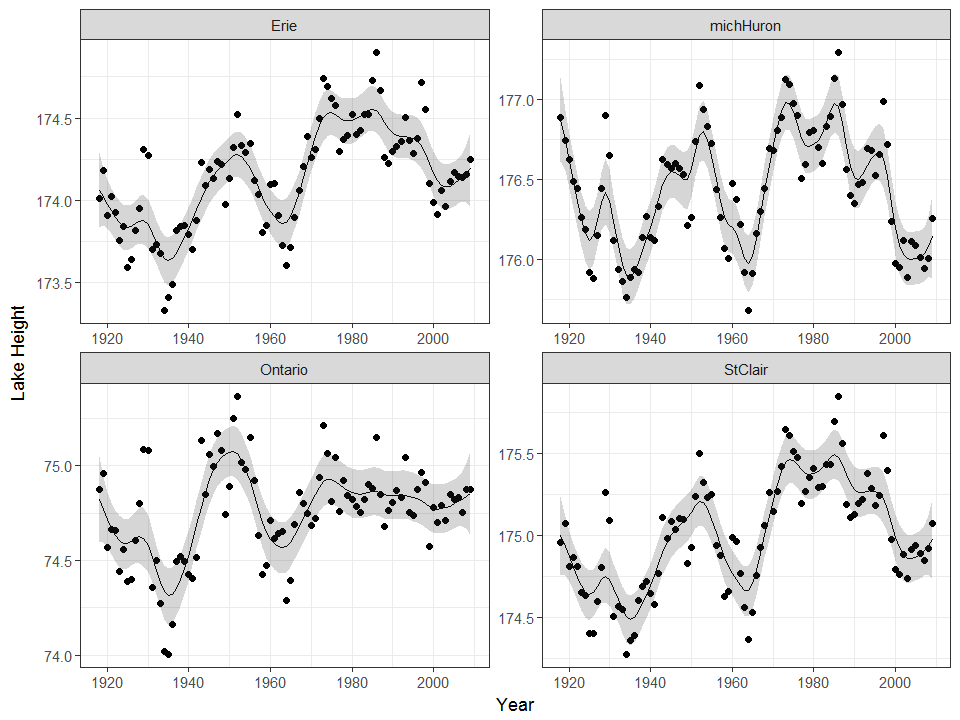

This is a tutorial on how to do time series analyses in R using [INLA](http://www.r-inla.org/ "INLA"), and visualize the results using [ggplot2](https://ggplot2.tidyverse.org/ "ggplot2"). The basis for the code is Alain Zuur and colleagues' new [book](http://www.highstat.com/index.php/beginner-s-guide-to-regression-models-with-spatial-and-temporal-correlation "book").


## Introduction
Time series analyses are useful for fitting models to data with temporal dependece, or temporal autocorrelation, where the values close together in time are more similar than values that are far apart in time. 
For this tutorial I am using the [greatLakes](https://www.rdocumentation.org/packages/DAAG/versions/1.22/topics/greatLakes greatLakes) from the [DAAG](https://www.rdocumentation.org/packages/DAAG/versions/1.22 DAAG) package. 
It is a dataset of yearly averages of Great Lake (Erie, Michigan/Huron, Ontario and St Clair) heights from 1918 - 2009. The heights are stored as a multivariate time series. 

I won't be spending any time doing any model selection in this tutorial,
nor any model evalution.

## Packages

First, we load a few packages.


```r
require(INLA)
require(ggplot2)
require(mgcv)
require(dplyr)
require(DAAG)
require(reshape2)
```

## Setting up the data

Now, we can load in the data.


```r
lakes <- greatLakes

```


And  visualize it. 


```r
plot(lakes, type = "p")
```

<!-- -->


For this analysis, we need to convert the data into a dataframe. Here's some code to do this. I have included how to return it to a time series dataframe too. 


```r
# from ts to data frame
lakes.df <- data.frame(as.matrix(lakes), year = time(lakes))

# from data frame ts
values <- lakes.df[, -5]

lakes <- ts(values,start = c(1918),end = c(2009), frequency=1)
```

So, because we have time series data at regular intervals, we can use a random walk model of order 2 [(RW2)](https://www.math.ntnu.no/inla/r-inla.org/doc/latent/rw2.pdf (RW2)). According to Zuur and colleagues, these models produce a 
smoother trend than RW1 models. 

Let's run the model!

For this first run, I will run the model for a single lake; lake Erie. 


```r
head(lakes.df)
##       Erie michHuron  Ontario  StClair year
## 1 174.0150  176.8867 74.87250 174.9567 1918
## 2 174.1808  176.7450 74.95583 175.0767 1919
## 3 173.9083  176.6250 74.56750 174.8150 1920
## 4 174.0258  176.4883 74.66583 174.8692 1921
## 5 173.9275  176.4450 74.65667 174.8108 1922
## 6 173.7575  176.2642 74.44333 174.6525 1923
i1 <- inla(Erie ~ f(year, model = "rw2"), control.compute = list(dic = TRUE), verbose = TRUE,
           
            family = "gaussian", data = lakes.df[, c(1, 5)])
```

We can look at the parameter estimates of the model, using 'summary'. We can also plot the fitted smoother, and then the predicted trend along with the data. For simplicity, these are done in base R, but could be easily run in ggplot2.


```r

summary(i1)
## 
## Call:
## c("inla(formula = Erie ~ f(year, model = \"rw2\"), family = \"gaussian\", ",  "    data = lakes.df[, c(1, 5)], verbose = TRUE, control.compute = list(dic = TRUE))" )
## 
## Time used:
##  Pre-processing    Running inla Post-processing           Total 
##          2.3012          1.9168          0.6530          4.8710 
## 
## Fixed effects:
##                 mean     sd 0.025quant 0.5quant 0.975quant     mode kld
## (Intercept) 174.1382 0.0104   174.1173 174.1382   174.1591 174.1382   0
## 
## Random effects:
## Name	  Model
##  year   RW2 model 
## 
## Model hyperparameters:
##                                           mean    sd 0.025quant 0.5quant
## Precision for the Gaussian observations 111.89 43.38      46.39   105.79
## Precision for year                       95.18 57.03      32.00    80.28
##                                         0.975quant  mode
## Precision for the Gaussian observations     214.03 93.41
## Precision for year                          244.77 59.55
## 
## Expected number of effective parameters(std dev): 40.52(10.47)
## Number of equivalent replicates : 2.271 
## 
## Deviance Information Criterion (DIC) ...: -128.84
## Effective number of parameters .........: 40.39
## 
## Marginal log-Likelihood:  -3.866 
## Posterior marginals for linear predictor and fitted values computed

yearsm <- i1$summary.random$year

plot(yearsm[, 1:2], type = 'l', 
     
      xlab = 'Year',
     
      ylab  = 'Smoother')

abline(h = 0 , lty = 3)

lines(yearsm[, c(1, 4)], lty = 2)

lines(yearsm[, c(1, 6)], lty = 2)
```

<!-- -->

```r

lakes.df$year <- as.numeric(lakes.df$year)


fit1 <- i1$summary.fitted.values

plot(x = lakes.df$year, y = lakes.df$Erie,
     
     xlab = "Year", 
     
     ylab = "Observed and fitted values")

lines(lakes.df$year, fit1$mean)

lines(lakes.df$year, fit1$`0.025quant`, lty = 2)

lines(lakes.df$year, fit1$`0.975quant`, lty = 2)
```

<!-- -->

```r

e1 <- lakes.df$Erie - fit1$mean

```


We can also run a model that will fit a single trend for all of the lakes. This may be a good initial model, although, realistically each lake will probably have a slightly different trend. We will set some prior parameter values (these can be played with to generate smoother or rougher fits). And then we can run the model. 

We also need to change the data to long format. I'll do that using 'melt'.


```r
# same trend for each lake
U <- 1

hyper.prec <- list(theta = list(prior = "pc.prec", param = c(U, 0.01)))

lakes.m <- melt(lakes.df, id.vars = "year")

f1 <- value ~ f(variable) + f(year, model = "rw2", scale.model = TRUE, 
                              hyper = hyper.prec)

i2 <- inla(f1, control.compute = list(dic = TRUE), family = "gaussian", data = lakes.m, verbose = TRUE)
```

We can now visualize the trend for each lake in ggplot2.


```r
fit2 <- i2$summary.fitted.values

lakes.m$mean.i2 <- fit2$mean

lakes.m$lo.i2 <- fit2$`0.025quant`

lakes.m$up.i2 <- fit2$`0.975quant`


ggplot(data = lakes.m, aes(x = year, y = value))+
  
  geom_point()+
  
  geom_line(aes(x = year, y = mean.i2))+
  
  geom_ribbon(aes(x = year, ymin = lo.i2, ymax = up.i2), alpha = 0.2)+
  
  facet_wrap(~variable, scales = "free")+
  
  xlab("Year")+
  
  ylab("Lake Height")+
  
  theme_bw()
```

<!-- -->

Notice that the same trend is fitted though each lake (in a separate panel). There are clearly places where the trend is not fitting all of the data in each lake.

We can try to improve the model fit by allowing separate trends for each lake. We fit a very similar model, but have to parameterize it differently (so that each lake is treated separately).


```r
# different trend for each lake  
lakes.m$Erie <- as.numeric(lakes.m$variable == "Erie")

lakes.m$michHuron <- as.numeric(lakes.m$variable == "michHuron")

lakes.m$Ontario <- as.numeric(lakes.m$variable == "Ontario")

lakes.m$StClair <- as.numeric(lakes.m$variable == "StClair")

lakes.m$year2 <-lakes.m$year

lakes.m$year3 <-lakes.m$year

lakes.m$year4 <-lakes.m$year

f2 <- value ~ f(variable) + 
  
              f(year, Erie, model = "rw2", scale.model = TRUE, 
                              hyper = hyper.prec) +
  
              f(year2, michHuron, model = "rw2", scale.model = TRUE, 
                              hyper = hyper.prec) +
  
              f(year3, Ontario, model = "rw2", scale.model = TRUE, 
                              hyper = hyper.prec) +
  
              f(year4, StClair, model = "rw2", scale.model = TRUE, 
                              hyper = hyper.prec)
  
i3 <- inla(f2, control.compute = list(dic = TRUE), family = "gaussian", data = lakes.m, verbose = TRUE)
```

Now we can visualize the trends. 


```r

fit3 <- i3$summary.fitted.values
lakes.m$mean.i3 <- fit3$mean
lakes.m$lo.i3 <- fit3$`0.025quant`
lakes.m$up.i3 <- fit3$`0.975quant`

ggplot(data = lakes.m, aes(x = year, y = value))+
  geom_point()+
  geom_line(aes(x = year, y = mean.i3))+
  geom_ribbon(aes(x = year, ymin = lo.i3, ymax = up.i3), alpha = 0.2)+
  facet_wrap(~variable, scales = "free") +
  xlab("Year")+
  ylab("Lake Height")+
  theme_bw()
```

<!-- -->


We can compare the model with a single trend to the model with separate trend, using DIC.


```r

c(i2$dic$dic, i3$dic$dic)
## [1] -373.2143 -196.5210
```


We can see that the model fitting separate trends to each lake has a better DIC score. 


That's if for this tutorial on time series analysis. 

Thanks for reading!

~Tim


## Reference
**Zuur AF, Ieno EN, Saveliev AA. 2017**. Beginner's guide to spatial, temporal and spatial-temporal ecological data analysis with R-INLA, volume I: using GLM and GLMM_. Highland Statistic Ltd; Newburgh, UK.


## Contact Me

Please check out my personal website at [timothyemoore.com](https://www.timothyemoore.com/ "timothyemoore.com")

